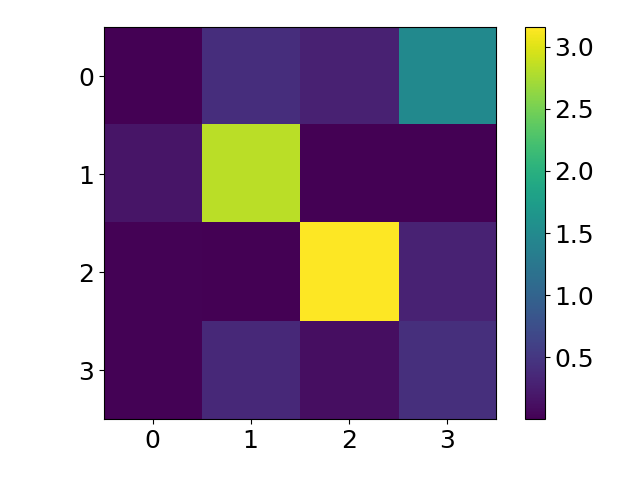

# TimeSeries-FECCNN
Time Series: Feature Extraction and Classification with Neural Networks for space applications.

Time series are functions of time which represent the evolution of some variables. Though these functions can be completely chaotic, it is usual to find concrete patterns in real life time series. In particular, when the variables are signals generated by space systems, such as telemetry data from a satellite, these patterns are highly related to the mission parameters (e.g. application orbit, exposure to Sun radiation, etc.). Therefore, time series in space applications are expected to have a certain degree of periodicity, due to the periodicity of orbits. Even if some signals are not periodic, during the operational phase most of the variables should remain stable around equilibrium points to assure the correct functioning of the system.

As a way to reduce the information behind these time series is through a feature extraction process, which allows to define the whole time series with a small set of key parameters that contain most of the information. This approach reduces the amount of data required to perform a following time series analysis, as it could be a classification task.

This repository allows to perform different approaches to Feature Extraction in time series in order to understand their behaviour. Then, these features can be used as an input to Classify the time series with Neural Networks.

For new users, there are several examples regarding:
    1) Spectral and statistical feature extraction.
    2) Bispectral transform.
    3) Spectrogram.
    4) Time series compression through the Haar transform.
    5) Haar compression error with the sampling rate.
    6) Haar series expansion.
    7) Haar Pattern Decomposition and Classification (HPDC).
    8) Haar Pattern Decomposition and Classification (HPDC): Classification coefficients' error.
    9) CNN classification: bispectrum as input.
   10) CNN classification: Haar coefficients as input.
   11) CNN classification: spectrogram as input.
   12) CNN classification: spectral and statistical features as input.

Analysis focused on power signals.
UK database of power signals to evaluate the software performances.

### Feature extraction
The selected approach is based on extracting some key features from the time series and use them to transform the time series to a 2D array, which facilitates the subsequent classification.
Four different methodologies for feature extraction:

a) Spectral and statistical features

  

b) Bispectrum

  

### Classification
CNN classification using four different inputs.

New classification approach: HPDC (Haar Pattern Decomposition and Classification).

## Universidad Politécnica de Madrid (UPM) - Technical University of Madrid
## Master Universitario en Sistemas Espaciales (MUSE) - Master Degree in Space Systems
## Instituto Ignacio Da Riva (IDR)
#### Developed by: David Huergo 
#### Supervised by: Juan Antonio Hernández
